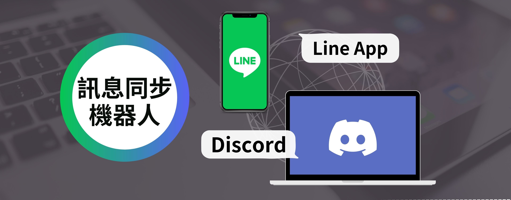
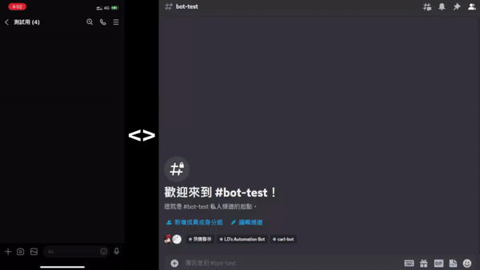

<div align="center">
  <h1 id="Discord-Line-Message-Sync">
    <a href="https://github.com/HappyGroupHub/Discord-Line-Message-Sync/" target="_blank">Discord / Line 訊息同步機器人</a>
  </h1>

[](https://github.com/HappyGroupHub/Discord-Line-Message-Sync/releases)
[](https://github.com/HappyGroupHub/Discord-Line-Message-Sync/releases)
[](https://github.com/HappyGroupHub/Discord-Line-Message-Sync/blob/master/LICENSE)


直接邀請機器人開始使用 | Invite Bots below to try it out！


[Line Bot Invite Link](https://line.me/R/ti/p/@391udwqf?from=page&accountId=391udwqf)

[Line Notify Invite Link](https://liff.line.me/1645278921-kWRPP32q/?accountId=linenotify)

[Discord Bot Invite Link](https://discord.com/api/oauth2/authorize?client_id=1058723203578609684&permissions=8&scope=bot)

</div>

# Discord Line Message Sync

📖 [繁體中文版README.md](#Discord-Line-訊息同步機器人) 📖

## A bot that syncs messages between Discord and Line


This bot is made to sync all kinds of messages between Discord and Line, using four applications including Line bot,
Line Notify, Discord bot and Discord webhook.



Supported messages sync types:

| Line -----to----> Discord   | Support |
|:----------------------------|:-------:|
| Text Message                |   ☑️    |
| Pictures                    |   ☑️    |
| Videos                      |   ☑️    |
| Audios                      |   ☑️    |
| Files                       |   ❌️    |
| Sticker                     |   ❌️    |
| Location                    |   ❌️    |
| Any other types of messages |   ❌️    |

| Discord -----to----> Line                    | Support |
|:---------------------------------------------|:-------:|
| Text Message                                 |   ☑️    |
| Pictures (jpg, jpeg, png)                    |   ☑️    | 
| Videos (mp4)                                 |   ☑️    |
| Audios (m4a, mp3, wav, aac, flac, ogg, opus) |   ☑️    |
| Other formats files                          |    ❌    |
| GIFs                                         |    ❌    |
| Sticker                                      |    ❌    |
| Any other types of messages                  |    ❌    |

You can definitely host this service yourself! and it's free!
Find it out by the following tutorial!

---

## Getting started to use the bot

### How to use

1. Download the latest release from [here](https://github.com/HappyGroupHub/Discord-Line-Message-Sync/releases)
2. Unzip the file then open up `config.yml`, [Notepad++](https://notepad-plus-plus.org/downloads/) is recommended
3. Fill in the following required information, see [here](#About-configyml) for more details
4. Now run `run.bat` to start the bot
5. Make sure you've invited the bot to your Discord server and added it / Line Notify to your Line group
6. In line group, send `!綁定` to stat the whole binding process, simply click the url the bot sent to you and follow
   the
   instructions
7. After you've finished binding with Line Notify, you should receive a binding code, send `/link <binding_code>` to
   the Discord channel you want to sync with
8. Done! Enjoy the Discord <> Line messages syncing service!

### Dependencies

- [ffmpeg](https://ffmpeg.org/download.html) - You need to install ffmpeg and add it to your PATH environment variable
  to use this bot

### About config.yml

```yaml
# ++--------------------------------++
# | Discord-Line-Message-Sync ver.   |
# | Made by LD (MIT License)         |
# ++--------------------------------++

# Bot Owner
# Fill in your name so others can know who is hosting the bot
# This will be shown when someone types /about
bot_owner: ''

# Paste your endpoint for the webhook here.
# You can use ngrok to get a free static endpoint now!
# Find out more here: https://ngrok.com/
webhook_url: ''

# Bot tokens and secrets
# You will need to fill in the tokens and secrets for your Line, Line Notify and Discord bots
# Line bot: https://developers.line.biz/console/
# Line Notify: https://notify-bot.line.me/my/services/
# Discord bot: https://discord.com/developers/applications/
Line_bot:
  channel_access_token: ''
  channel_secret: ''
Line_notify:
  client_id: ''
  client_secret: ''
Discord_bot:
  bot_token: ''


# (Optional settings)
# You can fill in your own bot invite link here
# This will be shown when someone types /about
# Noted that if you share your bot invite link, anyone can invite your bot to their server
line_bot_invite_link: ''
discord_bot_invite_link: ''
```

### How to get Webhook URL and what is it?

Basically, a webhook URL is an endpoint that other services can send us messages. In this case, we will use it to
receive messages from Line and Discord, so the value of `webhook_url` should be the URL(with HTTPS) of your server.
You can find out an easy way by using [ngrok](https://ngrok.com/), and here is
a [tutorial](#Use-Ngrok-to-create-a-static-reverse-proxy) for it.

### How to get Line channel access token and secret

1. Go to [Line Developers](https://developers.line.biz/console/) and login with your Line account
2. If you don't have a Business ID, simply create one by following the instructions
3. Then click `Create a new provider`
4. Fill in the required information and click `Create`
5. Click `Create a new channel` and select `Messaging API`
6. Fill in the required information and click `Create`
7. You can now find your channel secret in Basic settings and channel access token in Message API, click `Issue` to copy
   it

Notes: Please make sure you've **checked** `Allow bot to join group chats` option and **un-checked**
`Auto-reply messages`in your Line bot settings, which can be found in `Messaging API` > `LINE Official Account features`
section.

### Setting up Line webhook

1. Go to [Line Developers](https://developers.line.biz/console/) and login with your Line account
2. Select your channel application
3. Select Messaging API, find `Webhook URL` and click edit
4. Fill in your webhook URL and add `/callback` at the end
5. Click `Save` and it's pretty done!
6. Remember to check `Use webhook` under the `Webhook URL` section

Notes: Line webhook only works with HTTPS, so you need to use a reverse proxy to make it work.
If you don't know how to create a reverse proxy, you can use [ngrok](https://ngrok.com/) to create one easily,
find out how to use it [here](#Use-Ngrok-to-create-a-static-reverse-proxy).

### How to get Line Notify client ID and secret

1. Go to [Line Notify](https://notify-bot.line.me/my/services/) and login with your Line account
2. Click `Add service`
3. Fill in the service name with `【Discord訊息】`
4. Fill in the Callback URL with your webhook URL and add `/notify` at the end
5. Fill in other required information then click `Agree and continue`
6. You can now find your client ID and secret at the top of the page

### How to get Discord bot token

1. Go to [Discord Developer Portal](https://discord.com/developers/applications) and login with your Discord account
2. Click `New Application`
3. Fill in the name of application and click `Create`
4. Click `Bot` on the left side
5. Click `Add Bot`
6. Check `Presence Intent`, `Server Members Intent` and `Message Content Intent` under `Privileged Gateway Intents`
7. Now you can find your bot token in `Build-A-Bot` section, click `Reset Token` to copy it

### Use Ngrok to create a static reverse proxy

1. Go to [Ngrok](https://ngrok.com) sign up for an account and login
2. Click `+ New Domain` at the [Domains Dashboard](https://dashboard.ngrok.com/cloud-edge/domains), copy the domain
   name you created, which should be something like `sometihng-random-idontknow.ngrok-free.app`
3. Download the latest version of ngrok from [here](https://ngrok.com/download)
4. Extract the zip file you downloaded and run `ngrok.exe`
5. Run `ngrok config edit`, it'll open up a text editor
6. Replace the whole file with the following content
    ```yaml
    authtoken: <your_auth_token>
    version: 2
    tunnels:
        app:
            proto: http
            hostname: <domain_name>
            addr: 127.0.0.1:5000
    ```
    - Replace `<domain_name>` with the domain name you created at step 3
    - Replace `<your_auth_token>` with your auth token, which can be found
      at [here](https://dashboard.ngrok.com/get-started/your-authtoken)
7. Now save the config file then run `ngrok start app` at the command line
8. Copy the URL from `Fowarding`, it should be the same as the domain name you created at step 3
9. Done! Now you can use this URL as your webhook URL

---

## Contribute to this project

### How to contribute

1. Fork this repository
2. Clone your forked repository
3. Create a new branch
4. Make your changes
5. Commit and push your changes
6. Create a pull request
7. Wait for review

### Libraries used

* [Flask](https://github.com/pallets/flask) for webhook server
* [LineBotSDK](https://github.com/line/line-bot-sdk-python) for Line bot
* [discord.py](https://github.com/Rapptz/discord.py) for Discord bot
* [ZeroMQ](https://github.com/zeromq/pyzmq) for messaging between Line bot and Discord bot
* [PyYAML](https://github.com/yaml/pyyaml) for reading config file
* [requests](https://github.com/psf/requests) for sending HTTP requests
* [moviepy](https://github.com/Zulko/moviepy) for creating video thumbnail
* [pydub](https://github.com/jiaaro/pydub) for ffmpeg wrapper

### Code style and commits

* 100 characters per line
* Use `snake_case` for variables and functions
* Add a blank line at the end of the file
* Optimize imports, remove the redundant ones
* [Google style](https://google.github.io/styleguide/pyguide.html) TODO comments
* Use [Sphinx Docstring](https://sphinx-rtd-tutorial.readthedocs.io/en/latest/docstrings.html) style for docstrings
* Use these headers for commits
    - Update - your commit messages here
    - Fix bug - your commit messages here
    - Optimize - your commit messages here
    - Standardize - your commit messages here

### Find bugs or having suggestions?

If you have any suggestions or found any bugs, please open an
issue [here](https://github.com/HappyGroupHub/Discord-Line-Message-Sync/issues), will try to fix it as soon as possible.

### License

This project is licensed under the MIT License - see the [LICENSE](LICENSE) file for details

---

# Discord Line 訊息同步機器人

📖 [English README.md](#Discord-Line-Message-Sync) 📖

## 一個將Discord與Line訊息同步的聊天機器人


這個機器人將盡可能的同步Discord與Line的所有訊息，運用包括Line bot、Line Notify、Discord bot及Discord webhook等技術。


目前支援同步的訊息種類:

| Line -----傳送至----> Discord | 支援 |
|:---------------------------|:--:|
| 文字訊息                       | ☑️ |
| 圖片                         | ☑️ |
| 影片                         | ☑️ |
| 音檔                         | ☑️ |
| 檔案                         | ❌️ |
| 貼圖                         | ❌️ |
| 位置訊息                       | ❌️ |
| 任何其他種類的訊息                  | ❌️ |

| Discord -----傳送至----> Line               | 支援 |
|:-----------------------------------------|:--:|
| 文字訊息                                     | ☑️ |
| 圖片 (jpg, jpeg, png)                      | ☑️ | 
| 影片 (mp4)                                 | ☑️ |
| 音檔 (m4a, mp3, wav, aac, flac, ogg, opus) | ☑️ |
| 其他種類的檔案                                  | ❌  |
| GIFs                                     | ❌  |
| 貼圖                                       | ❌  |
| 任何其他種類的訊息                                | ❌  |

想要自己架設這個訊息同步機器人嗎?
快點看看下面的使用教學吧!

---

## 開始使用

### 如何下載及運行

1. 從 [這裡](https://github.com/HappyGroupHub/Discord-Line-Message-Sync/releases) 下載最新的版本
2. 解壓縮檔案後，於資料夾內開啟 `config.yml`, 建議使用 [Notepad++](https://notepad-plus-plus.org/downloads/)來編輯檔案
3. 遵照內文完成填寫 `config.yml`，請參考 [這裡](#關於-configyml)
4. 運行 `run.bat`
5. 確認你已經邀請Line bot/Line Notify/Discord bot至你的伺服器及聊天室
6. 在 Line 群組中，發送 `!綁定` 開始整個綁定流程，點擊機器人發送給你的 URL 並依照指示操作
7. 當你完成 Line Notify 的綁定後，你將收到一個綁定代碼，請將 `/link <binding_code>` 發送到你想要同步的 Discord 頻道
8. 完成！盡情享受 | Discord<>Line | 訊息同步服務吧！

### 系統需求

* [ffmpeg](https://ffmpeg.org/download.html) - 你必須安裝ffmpeg，並將其路徑加入環境變數才可使用此機器人

### 關於 config.yml

```yaml
# ++--------------------------------++
# | Discord-Line-Message-Sync ver.   |
# | Made by LD (MIT License)         |
# ++--------------------------------++

# Bot Owner
# Fill in your name so others can know who is hosting the bot
# This will be shown when someone types /about
bot_owner: ''

# Paste your endpoint for the webhook here.
# You can use ngrok to get a free static endpoint now!
# Find out more here: https://ngrok.com/
webhook_url: ''

# Bot tokens and secrets
# You will need to fill in the tokens and secrets for your Line, Line Notify and Discord bots
# Line bot: https://developers.line.biz/console/
# Line Notify: https://notify-bot.line.me/my/services/
# Discord bot: https://discord.com/developers/applications/
Line_bot:
  channel_access_token: ''
  channel_secret: ''
Line_notify:
  client_id: ''
  client_secret: ''
Discord_bot:
  bot_token: ''


# (Optional settings)
# You can fill in your own bot invite link here
# This will be shown when someone types /about
# Noted that if you share your bot invite link, anyone can invite your bot to their server
line_bot_invite_link: ''
discord_bot_invite_link: ''
```

### 什麼是 Webhook URL? 我該怎麼獲取它?

簡單來說，Webhook URL 是其他服務可以用來將訊息發送給我們的端點網址。而我們將使用它來接收來自 Line 和 Discord
的訊息，所以 `webhook_url` 的值應該是你伺服器的對外URL網址(需為HTTPS協議)。你可以使用 [ngrok](https://ngrok.com/)
來簡單的達成此目標，請參考 [這裡的教學](#使用-Ngrok-建立符合-HTTPS-協議的端點網址)

### 獲取 Line channel access token 及 secret

1. 前往 [Line Developers](https://developers.line.biz/console/) 並使用你的Line帳號登入
2. 如果你沒有 Business ID，請按照官網的指示建立一個
3. 點擊 `Create a new provider`
4. 填寫完需要的資料後點擊 `Create`
5. 點擊 `Create a new channel` 並選擇 `Messaging API` 的分類
6. 填寫完需要的資料後點擊 `Create`
7. 現在你可以在 Basic settings 找到你的 `channel secret` 以及在 Message API 找到 `channel access token`，點擊 `Issue` 來複製

註：請確保你在 Line 機器人設定中的 `Messaging API` > `LINE Official Account features`， **勾選**
`Allow bot to join group chats` 選項，並 **取消勾選** `Auto-reply messages` 選項

### 設定 Line Webhook

1. 前往 [Line Developers](https://developers.line.biz/console/) 並使用你的Line帳號登入
2. 點擊你要使用的 `channel application`
3. 選擇 Messaging API 分類, 找到 `Webhook URL` 並點擊 `edit`
4. 貼上你的 Webhook URL 並在尾處加上 `/callback`
5. 點擊 `Save`
6. 在 `Webhook URL` 底下勾選 `Use webhook`

註：Line Webhook 僅適用於 `HTTPS` 協議，恕不接受任何未經認證過的網址
如果你不知道如何申請，可以使用 [ngrok](https://ngrok.com/)
創建一個簡單的導向服務，請參考 [這裡的教學](#使用-Ngrok-建立符合-HTTPS-協議的端點網址)

### 獲取 Line Notify client ID 及 secret

1. 前往 [Line Notify](https://notify-bot.line.me/my/services/)，並使用您的 Line 帳號登入
2. 點擊 `Add service`
3. 在 Service Name 欄位輸入 `【Discord訊息】`
4. 在 Callback URL 欄位輸入您的 Webhook URL，並在尾處加上 `/notify`
5. 填寫其他必要資訊，然後點擊 `Agree and continue`
6. 您現在可以在頁面頂部找到您的客戶端 ID 和密鑰

### 獲取 Discord bot token

1. 前往 [Discord Developer Portal](https://discord.com/developers/applications) 並使用你的Discord帳號登入
2. 點擊 `New Application`
3. 幫此機器人取名為 `Line訊息` 後點擊 `Create`
4. 點擊左側列表的 `Bot`
5. 點擊 `Add Bot`
6. 在 `Privileged Gateway Intents` 底下將 `Presence Intent`, `Server Members Intent` 及 `Message Content Intent` 都打勾
7. 現在你可以在 `Build-A-Bot` 底下找到你的 bot token，點擊 `Reset Token` 來複製

### 使用 Ngrok 建立符合 HTTPS 協議的端點網址

1. 前往 [Ngrok](https://ngrok.com) 註冊一個帳號並登入
2. 在 [Domains Dashboard](https://dashboard.ngrok.com/cloud-edge/domains) 中點擊 `+ New Domain`
   ，複製您所建立的網域名稱，成功的話應該會長這樣 `something-random-idontknow.ngrok-free.app`
3. 從 [這裡](https://ngrok.com/download) 下載最新版本的 ngrok 程式
4. 解壓縮你下載的 zip 檔案，然後執行 `ngrok.exe`
5. 執行 `ngrok config edit`，它會打開一個文字編輯器
6. 複製以下並完全替代原本的內容
    ```yaml
    authtoken: <your_auth_token>
    version: 2
    tunnels:
        app:
            proto: http
            hostname: <domain_name>
            addr: 127.0.0.1:5000
    ```
    - 把 `<domain_name>` 替換為您在步驟3所建立的網域名稱
    - 把 `<your_auth_token>` 替換為您的授權金鑰，您可以在 [這裡](https://dashboard.ngrok.com/get-started/your-authtoken)
      找到
7. 現在儲存檔案並關閉，繼續在命令行中執行 `ngrok start app`
8. 複製 `Fowarding` 所生成的URL，它應該與您在步驟3中創建的網域名稱相同
9. 完成！現在你可以將此 URL 作為你的 Webhook URL

---

## 協助這個專案開發

### 如何貢獻

1. Fork 這個專案
2. 複製你剛剛 Fork 的專案至本地
3. 建立新的分支
4. 盡情發揮你的能力
5. Commit / Push 你的程式碼
6. 建立新的 Pull Request
7. 等待回覆

### 使用的函式庫

* [Flask](https://github.com/pallets/flask) 用來架設Webhook伺服器
* [LineBotSDK](https://github.com/line/line-bot-sdk-python) 用來與Line API溝通
* [discord.py](https://github.com/Rapptz/discord.py) 用來與Discord API溝通
* [ZeroMQ](https://github.com/zeromq/pyzmq) 用來在兩個程式之間進行溝通
* [PyYAML](https://github.com/yaml/pyyaml) 用來讀取config.yml檔案
* [requests](https://github.com/psf/requests) 用來傳送HTTP請求
* [moviepy](https://github.com/Zulko/moviepy) 用來製作影片的縮圖
* [pydub](https://github.com/jiaaro/pydub) 用來使用ffmpeg處理影音檔案

### 程式碼撰寫/提交規範

* 每行不超過100個字元
* 使用 `snake_case` 命名變數及函式
* 在檔案尾處加上一個空行
* 最佳化程式碼並移除不必要的import
* [Google style](https://google.github.io/styleguide/pyguide.html) TODO註解
* 使用 [Sphinx Docstring](https://sphinx-rtd-tutorial.readthedocs.io/en/latest/docstrings.html) 進行函式註解
* 提交請求時請使用以下格式，並全英文撰寫
    - Update - your commit messages here
    - Fix bug - your commit messages here
    - Optimize - your commit messages here
    - Standardize - your commit messages here

### 建議/問題回報

如果你有任何建議或是發現了任何問題，請在 [Issues](https://github.com/HappyGroupHub/Discord-Line-Message-Sync/issues)
提交你的意見，我會盡快回覆你!

### 版權

此專案的版權規範採用 **MIT License** - 至 [LICENSE](LICENSE) 查看更多相關聲明
